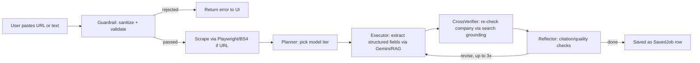
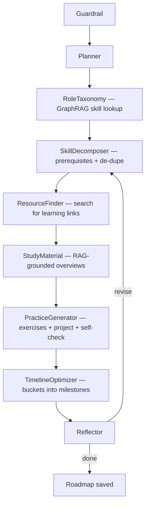
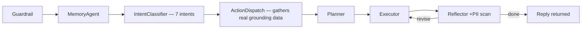
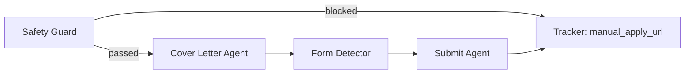
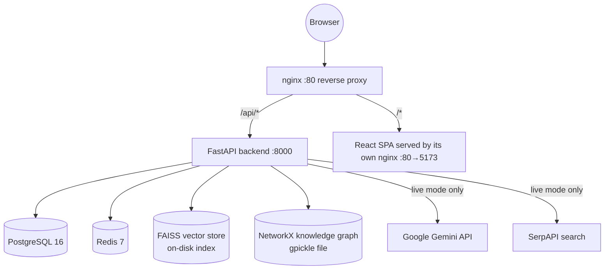

# CareerKundi

Agentic AI career platform: job import & search, AI-written CVs, interview prep, career roadmaps, an AI career assistant, and a safety-gated auto-apply workflow — built on a FastAPI + LangGraph multi-agent backend and a React/Vite frontend.

This README was generated by directly inspecting the codebase (routes, agent graphs, models, config, Docker, CI) rather than from assumptions. Where something is only partially wired up, it is labeled **Planned / Not fully implemented yet** instead of described as working.

---

## 1. Overview

CareerKundi is a full-stack, self-hostable web application that helps a job seeker go from "I found a posting" to "I applied with a tailored CV and prepped for the interview." The backend is a FastAPI service built around **LangGraph multi-agent pipelines** (Guardrail → Planner → Executor → Reflector, with feature-specific extra stages) that call **Google Gemini** for generation and **RAG/GraphRAG** for grounding. The frontend is a React 18 + TypeScript single-page app.

The whole platform is designed to run with **zero API keys**: every Gemini call and every search call has a deterministic mock provider, so you can clone the repo, run one command, and click through every feature before ever adding a `GEMINI_API_KEY`.

## 2. What This Project Does

At a glance, CareerKundi lets a signed-in user:

- Import a job posting from a URL (scraped) or pasted text, and get it structured, RAG-grounded, and cross-verified into a saved job record.
- Track saved jobs through a status pipeline (`saved → applied → interviewing → offered → rejected`).
- Generate an interview prep pack (questions + guidance) for a saved job.
- Build a profile once (education, experience, projects, skills, etc.) and generate multiple tailored CVs from it, in 10 visual/ATS templates, exportable as Markdown, PDF, or DOCX.
- Generate a personalized career roadmap for a target role — skills to learn, learning resources, study material, practice exercises, and a milestone timeline.
- Chat with an AI career assistant (a full page and a floating widget) that remembers context across sessions and can answer questions grounded in the user's own data.
- Earn badges/achievements for platform activity (39 badges across 8 categories).
- Attempt a safety-gated "auto-apply" flow that generates a cover letter and walks through form detection — with hard blocks on platforms that forbid automation (see [§36 Known Limitations](#36-known-limitations) for what this does **not** yet do).

## 3. Who This Project Is For

- **Job seekers** who want AI help with CV writing, interview prep, and organizing a job search.
- **Developers learning agentic AI / LangGraph patterns** — the codebase is a real, working reference implementation of Guardrail → Planner → Executor → Reflector pipelines with cost control and hallucination-mitigation baked in, not a toy example.
- **Contributors / beginners setting up the project locally** to extend it — this README's setup, troubleshooting, and architecture sections are written for that audience specifically.

## 4. Key Features

| Feature | Status |
|---|---|
| Auth (register / login / refresh / logout) | Implemented |
| Profile (multi-section CRUD) | Implemented |
| Job import from URL or pasted text | Implemented |
| Saved-job list, keyword search, status tracker | Implemented |
| Profile Match Rating (fit score badge on jobs) | Planned / Not fully implemented yet |
| Interview Pack Generator | Implemented |
| CV Builder (AI bullet writing, 10 templates, live preview) | Implemented |
| CV export (Markdown / PDF / DOCX) | Backend implemented; frontend download button not wired — Partially implemented |
| CV Viewer (in-browser template preview) | Implemented (HTML approximation, not the real PDF) |
| Career Roadmap Generator | Implemented |
| Study Material Generator (per-skill, inside roadmap) | Implemented |
| Practice Sessions (per-skill exercises, inside roadmap) | Implemented |
| Skill content refresh / mark-complete | Implemented |
| AI Career Assistant (chat page + floating widget) | Implemented |
| Cross-session agent memory | Implemented |
| Badge / achievement system | Implemented |
| Dashboard | Implemented |
| Auto-Apply (safety gate, cover letter, form detection) | Partially implemented — see limitations |
| Auto-Apply real submission (browser automation / email) | Planned / Not fully implemented yet |
| Background job queue (bulk PDF/bundle generation) | Backend stubbed, unused by frontend — Planned / Not fully implemented yet |
| Automated tests | Not currently included |

## 5. Feature-by-Feature Technology Breakdown

| Feature | Technologies Used | Purpose of Each Technology | Status |
|---|---|---|---|
| Job Import (URL/paste) | Playwright, BeautifulSoup4, lxml, LangGraph, Gemini Flash, FAISS, NetworkX | Playwright/BS4 scrape and parse the page; LangGraph orchestrates Guardrail→Planner→Executor→CrossVerifier→Reflector; Gemini extracts structured fields; FAISS/NetworkX ground extraction in prior postings/skills | Implemented |
| Interview Pack Generator | LangGraph, Gemini Flash/Pro, RAG (FAISS) | Guardrail→Planner→Executor→Reflector pipeline generates grounded interview questions for a saved job | Implemented |
| CV Builder | LangGraph, Gemini, fabrication-diff safety check, WeasyPrint, python-docx, markdown2 | Agents write bullets grounded only in the user's real profile; WeasyPrint/python-docx/markdown2 render the approved draft to file formats outside the agent graph (no LLM cost on export) | Implemented (export backend), Partially implemented (export UI) |
| Career Roadmap | LangGraph (9-node custom graph), NetworkX (GraphRAG), FAISS (RAG), Gemini | RoleTaxonomy/ResourceFinder/StudyMaterial/PracticeGenerator agents pull from the knowledge graph and vector store and call Gemini; TimelineOptimizer and SkillDecomposer are deterministic scheduling/graph logic | Implemented |
| AI Career Assistant | LangGraph (7-node custom graph), Gemini, RAG, GraphRAG, cross-session memory table | MemoryAgent + IntentClassifier + ActionDispatch gather real grounding data before an Executor drafts a reply; Reflector adds a PII output scan | Implemented |
| Badge System | SQLAlchemy event-driven service (`fire_event`), Postgres | Deterministic Python logic (no LLM) awards badges when routes fire named metrics; no AI involved | Implemented |
| Auto-Apply | LangGraph (5-node custom graph), Gemini (cover letter only) | Safety Guard blocks known ToS-restricted platforms; Cover Letter agent writes from real profile/job data only; Submit agent is currently simulated, not real automation | Partially implemented |
| Auth | python-jose (JWT), bcrypt, slowapi | Token issuance/verification, password hashing, per-tier rate limiting | Implemented |
| Cost Monitoring | Custom `CostMonitor` class, Prometheus client | Tracks tokens/estimated cost per pipeline run, enforces a per-request token budget, tiered flash/pro routing | Implemented |

## 6. How Each Feature Is Built

Every feature follows the same base shape unless noted: **Guardrail → Planner → Executor → Reflector**, compiled as a LangGraph `StateGraph`, with the Reflector able to loop back for up to 3 revision rounds. Mock mode and live (Gemini) mode share 100% of this logic — only the LLM/search calls themselves swap.

### Job Import (URL or pasted text)



1. User pastes a URL or raw job text (`JobSearchPage`).
2. `POST /job-search/parse` calls `run_job_enrichment_pipeline()`.
3. If a URL was given, `scrape_job_posting()` fetches it server-side first — scraping failure returns a clear "paste the text instead" error rather than entering the agent graph with nothing to work on.
4. Guardrail sanitizes input and screens for prompt injection.
5. Planner picks a model tier; Executor extracts structured fields (title, company, salary, skills, etc.), grounded in RAG context and growing the knowledge graph with the new posting.
6. CrossVerifier independently re-checks the company name via search grounding (always honestly `verified=False` in mock mode — it never claims verification it can't back up).
7. Reflector checks citations/generic-language/unsupported claims and can send it back for revision.
8. Result is persisted as a `SavedJob` row with `verification_status`.

A separate, simpler 4-node pipeline (`agents/job_extractor`) also exists for `POST /apply/extract-url`, used by the apply-workflow's "import and immediately review" path: Guardrail → Scraper → Extractor → Reflector, with no CrossVerifier step.

### Interview Pack Generator

1. User selects a saved job and clicks "Generate Interview Pack" (`InterviewPackPage`).
2. `POST /job-search/{job_id}/interview-pack` calls `run_interview_pack_pipeline()` against the job's already-enriched snapshot.
3. Guardrail → Planner → Executor (writes questions grounded in the job's real requirements/skills) → Reflector (citation + quality checks, up to 3 revisions).
4. Result is stored and fetchable via `GET /job-search/{job_id}/interview-pack`.

### CV Builder

1. User builds a Profile once (`ProfilePage`) — education, experience, projects, skills, certifications, etc.
2. On `CVBuilderPage`, user picks a template (10 available), sections to include, tone, and optionally a target job to tailor toward.
3. `POST /cv-builder/generate` calls `run_cv_generation_pipeline()`: Guardrail → Planner → `CVBulletWriterExecutorAgent` → `CVReflectorAgent`.
4. Every "enhanced" bullet is diffed against an allowed corpus built from the user's *own* real input (`_check_bullet_fabrication`) — any new number or proper noun that doesn't trace back to something the user actually wrote is flagged. This is a deterministic code check, not just a prompt instruction.
5. Once approved, `render_cv()` (plain template code, **not** an agent graph node — rendering is deterministic and should not cost tokens) builds the section-by-section `rendered_content` JSON.
6. The frontend renders this as a live, styled HTML preview (the "CV Viewer" — see [§26](#26-cv-viewer-guide)).
7. A single-bullet "Improve with AI" path on the Profile page runs the same Guardrail→Planner→Executor→Reflector shape as a lightweight 4-node pipeline (`BulletImprovement*` agents).
8. Real file export (Markdown/PDF/DOCX) is available via `GET /cv-builder/{id}/export`, built by `tools/document_export.py` — this is verified working on the backend but **not currently triggered by any button in the UI** (see [§36](#36-known-limitations)).

### Career Roadmap Generator (+ Study Material + Practice Sessions)

The roadmap pipeline needs more stages than the standard shape, so it hand-builds its own 9-node graph:



1. User enters a target role, pace, and starting skill level (`RoadmapPage`).
2. `POST /roadmap/generate` runs the graph above.
3. **RoleTaxonomyAgent** resolves the role against a seeded knowledge graph, or infers a skill set for novel roles and grows the graph for future users.
4. **SkillDecomposerAgent** (deterministic) pulls prerequisites, marks skills the user's profile already shows as complete, and de-duplicates.
5. **ResourceFinderAgent** finds learning resources per skill via the search tool (honestly labeled `verified=False` in mock mode).
6. **StudyMaterialAgent** — this *is* the "Study Material Generator": RAG-grounded overview + key concepts per skill the user doesn't already know.
7. **PracticeGeneratorAgent** — this *is* "Practice Sessions": hands-on exercises, a project idea, and self-assessment questions per skill. These are generated content attached to each skill in the roadmap, not a separate interactive quiz UI.
8. **TimelineOptimizerAgent** (deterministic) buckets skills into milestones sized by pace/weekly hours.
9. Reflector checks the full draft; revision re-enters at SkillDecomposer (role taxonomy doesn't need to be redone).
10. A lightweight 4-node "skill refresh" pipeline (`run_skill_refresh_pipeline`) regenerates one skill's resources/study material/practice content without re-running the whole roadmap.

### AI Career Assistant (Chatbot)

The chatbot also needs more than 4 stages, so it hand-builds a 7-node graph:



1. User sends a message from `ChatbotPage` or the floating widget (available on every authenticated page).
2. Route layer pre-loads recent session history, cross-session long-term memory, and a flat snapshot of the user's profile/jobs/roadmap/CV counts — agents never touch the database directly.
3. MemoryAgent merges history + long-term memory into a grounding digest, and proposes new facts to remember by scanning the user's own message (never invents what the user meant).
4. IntentClassifier routes to one of seven intents.
5. ActionDispatch gathers real RAG/GraphRAG/search context plus literal numbers already in the snapshot — it never re-derives or guesses at data.
6. Executor drafts the reply; Reflector runs the standard checks plus a PII output scan before the reply reaches the user.
7. On revision, only the Executor re-runs (re-classifying intent every retry would be wasteful and inconsistent).

### Auto-Apply



1. User confirms intent to auto-apply to a saved job (explicit `user_confirmed=True` required — the pipeline raises immediately otherwise).
2. **Safety Guard** blocks known ToS-restricted domains outright (LinkedIn, Greenhouse, Lever, Workday, Taleo, iCIMS, SmartRecruiters, Jobvite) and returns a manual-apply link.
3. **Cover Letter Agent** writes a letter using only the real profile and job description already on file (no invented experience).
4. **Form Detector** classifies the application as `direct_email`, `portal_apply`, or `blocked`.
5. **Submit Agent** logs every field before "submitting." **In both mock and live mode this step is currently simulated** — see [§36](#36-known-limitations) for exactly what that means.
6. **Tracker Agent** always records a `manual_apply_url` fallback and a structured step log.

## 7. How Each Feature Can Be Improved

| Feature | Realistic Improvement |
|---|---|
| Job import | Real job-board APIs (Greenhouse/Lever public APIs) instead of scraping-only; resume/job parsing via a dedicated ATS-parsing library |
| Profile Match Rating | Implement the scoring logic (embedding similarity between profile skills and job requirements via the existing FAISS store) — the field and UI already exist end-to-end |
| Interview Pack | Gemini streaming for token-by-token question generation; voice mock interviews |
| CV Builder | Wire the existing `cvApi.downloadPdf()` to the "Export PDF/DOCX" button; ATS scoring against the generated CV; ship a real PDF preview instead of the HTML approximation |
| Roadmap | O*NET/ESCO skill taxonomy instead of the seeded knowledge graph; spaced-repetition scheduling for study material |
| Chatbot | Prompt caching for repeated grounding context; semantic search over long-term memory instead of flat dict lookup |
| Badges | Email/push notifications on badge unlock |
| Auto-Apply | Real Playwright-based form automation (already a project dependency) or SMTP integration for `direct_email` applications, with an explicit per-submission confirmation step |
| Background Queue | Wire `queueApi` into the UI, mount a real `/downloads` static route or object storage (S3), and replace the simulated `_execute_job` branches with real generation calls |
| Infra | Redis-backed Celery/RQ worker instead of `asyncio.create_task` for the job queue; CI/CD via Terraform or AWS CDK; Sentry for error tracking; CloudWatch/Prometheus+Grafana dashboards |
| Testing | Add the pytest/vitest suites the tooling is already configured for — `backend/tests/` and `frontend/tests/` currently exist but are empty |

## 8. Tech Stack

**Backend**: Python 3.11+, FastAPI, Uvicorn, Pydantic v2 / pydantic-settings, SQLAlchemy 2.0 (async), Alembic, asyncpg, Redis-py, LangChain, LangGraph, langchain-google-genai, google-generativeai, FAISS (faiss-cpu), NetworkX, sentence-transformers (local embedding fallback), Playwright, BeautifulSoup4, lxml, httpx, WeasyPrint, python-docx, markdown2, python-jose, bcrypt, slowapi, structlog, OpenTelemetry API/SDK, prometheus-client, tenacity.

**Frontend**: React 18, TypeScript 5, Vite 5, React Router 6, TanStack Query 5, Zustand 4 (state), Axios, Framer Motion, Recharts, react-markdown, react-syntax-highlighter, lucide-react (icons), date-fns, clsx.

**Data / Infra**: PostgreSQL 16, Redis 7, FAISS local vector index, NetworkX knowledge graph (pickled to disk), Docker + Docker Compose, nginx (reverse proxy + static SPA hosting).

**Tooling**: `uv` (backend package manager), npm, ESLint + Prettier, Ruff + Black + mypy, pytest + pytest-asyncio + pytest-cov (configured, unused — see [§36](#36-known-limitations)), Vitest (configured, unused), GitHub Actions.

## 9. Architecture Overview



The backend is a single FastAPI process; there is no separate microservice per feature. Each feature is a router (`app/api/routes/*.py`) backed by its own LangGraph agent package (`app/agents/<feature>/`). Everything shares one Postgres database, one Redis instance, one FAISS index, and one knowledge-graph file. In Docker, a top-level `nginx` container is the single public entry point (port 80), routing `/api/*` to the backend and everything else to the frontend container; the frontend container also runs its own nginx to serve the static Vite build with SPA fallback routing.

## 10. Folder Structure

```
Career_Kundi_2/
├── backend/
│   ├── app/
│   │   ├── agents/           # One package per feature: auto_apply, chatbot, common,
│   │   │                     # cv_builder, job_extractor, job_search, roadmap
│   │   ├── api/routes/       # FastAPI routers — one file per feature
│   │   ├── core/             # config, logging, security, middleware, error envelope
│   │   ├── data/             # badge catalogue + RAG/GraphRAG seed data
│   │   ├── db/                # SQLAlchemy models, session, Alembic migrations
│   │   ├── schemas/           # Pydantic request/response models
│   │   ├── services/          # Badge event service
│   │   ├── tools/             # llm.py, rag.py, graph_rag.py, search.py, scraper.py,
│   │   │                      # document_export.py, cache.py, embeddings.py
│   │   └── main.py            # FastAPI app factory
│   ├── data/                  # Persisted FAISS index + knowledge_graph.gpickle
│   ├── scripts/seed.py        # DB connectivity check (NOT a real data seeder — see §36)
│   ├── tests/                 # Empty — see §36
│   └── pyproject.toml
├── frontend/
│   ├── src/
│   │   ├── pages/              # One file per route (Dashboard, JobSearch, CVBuilder, ...)
│   │   ├── components/         # layout (AppShell/Header/Sidebar), ui/, chatbot/
│   │   ├── lib/api.ts           # Axios client + all backend endpoint wrappers
│   │   └── store/               # Zustand stores (auth, ui)
│   ├── tests/                   # Empty — see §36
│   └── package.json
├── infra/nginx/nginx.conf       # Top-level reverse proxy config
├── docker-compose.yml            # Production-shaped full stack
├── docker-compose.dev.yml        # Hot-reload dev overlay
├── Makefile                       # Single entry point for all dev/build/test commands
├── .env.example                   # Root/Docker env reference (authoritative — see §13)
└── backend/.env.example           # Backend-local env reference (stale — see §13)
```

## 11. AI / Gemini API Usage

Gemini is the only LLM provider integrated. It is used by every agent Executor across all six feature pipelines (job import, interview packs, CV bullets, roadmap generation, chatbot replies, auto-apply cover letters).

- **Models**: `gemini-2.5-flash` (default/routine tier) and `gemini-2.5-pro` (escalated tier), plus `text-embedding-004` for RAG embeddings, all configured via env vars, never hardcoded.
- **Integration path**: `langchain_google_genai.ChatGoogleGenerativeAI`, wrapped by `app/tools/llm.py`'s `GeminiProvider`, giving every agent a single `.generate()` / `.stream()` interface regardless of provider.
- **Structured output**: when an agent needs JSON, `with_structured_output(json_schema)` binds the response schema so Gemini must return data matching the agent's Pydantic contract.
- **Getting a key**: [aistudio.google.com/app/apikey](https://aistudio.google.com/app/apikey), then set `GEMINI_API_KEY` in `.env` (root, for Docker).
- **If the key is missing**: `settings.llm_mode` automatically resolves to `"mock"` and `MockGeminiProvider` takes over — deterministic, content-aware, schema-valid synthetic output (including simulated token streaming) so every feature still runs end-to-end for free. No code path anywhere checks for the key and crashes; this is a first-class supported mode, not a fallback hack.
- **Prompt structure**: every Executor's system prompt is composed by `build_system_prompt()` from a role description + three shared directives (ground every claim in numbered context, no generic boilerplate, no artificial item-count limits) + an explicit 11-point rejection-criteria list the model is told upfront the Reflector will check.
- **Chunking**: not implemented as literal token-chunking; instead, large multi-stage features (roadmap, chatbot) are broken into multiple smaller agent calls (per-skill, per-turn) rather than one giant generation.
- **Error handling**: `GeminiProvider.generate()` retries up to 3 times with exponential backoff (`tenacity`); a failed pipeline surfaces through the standard `{error, code, message, details}` JSON envelope.

## 12. Multi-Agent Workflow

**What an agent is here**: a small class (`BaseAgent` subclass) with one `run(state) -> partial_state_update` method, adapted into a LangGraph node via `as_node()`, which adds uniform timing/error-to-state handling so one agent's exception becomes a clean `state["error"]` instead of crashing the whole pipeline.

**Why agents, plural**: splitting "validate input," "plan," "generate," and "check quality" into separate stages means a Reflector's rejection can trigger a targeted re-generation (Executor only) without re-validating or re-planning, and means safety checks run *before* any tokens are spent.

**The real role pattern** (there is no separate "Formatter Agent" in this codebase — deterministic formatting/rendering is deliberately kept **outside** the agent graph as plain code, e.g. CV rendering and PDF/DOCX export, so it never costs tokens):

| Role | Responsibility | Present in |
|---|---|---|
| **Guardrail** | Sanitizes input, screens for prompt injection, feature-specific structural checks. Rejection short-circuits straight to an error — nothing downstream runs. | Every feature |
| **Planner** | Picks a model tier (flash vs. pro) based on input length / prior confidence. Usually deterministic, no LLM call itself. | Every feature |
| **Executor** | The actual generation step — calls Gemini (or the mock provider) with a schema. | Every feature |
| **Extra stages** | Feature-specific real work between Planner and Reflector — e.g. Job Search's `CrossVerifierAgent`, Roadmap's six stages (RoleTaxonomy/SkillDecomposer/ResourceFinder/StudyMaterial/PracticeGenerator/TimelineOptimizer), Chatbot's `MemoryAgent`/`IntentClassifier`/`ActionDispatch` | Job Search, Roadmap, Chatbot |
| **Reflector** | Deterministic code checks (citation integrity, generic-language detection, unsupported-claim heuristics, confidence scoring) — not just "ask the LLM to grade itself." Can force up to 3 revision rounds. | Every feature except Auto-Apply |

**How Gemini fits in**: Planner/SkillDecomposer/TimelineOptimizer/MemoryAgent/ActionDispatch are deterministic Python (no LLM call in either mode); Guardrail only calls a regex pattern library; Executors and a few specialized stages (RoleTaxonomy, ResourceFinder, StudyMaterial, PracticeGenerator, IntentClassifier) are the actual Gemini-calling nodes.

**Which features use agents**: all of job import, interview packs, CV builder (+ bullet improvement), roadmap (+ skill refresh), chatbot, and auto-apply. Auth, Profile CRUD, and the badge system are plain FastAPI + SQLAlchemy — no agents, by design (there's nothing to generate).

## 13. Environment Variables

`backend/app/core/config.py` is the single source of truth (a Pydantic `Settings` class) — this table matches it exactly. **Use the root `.env.example`, not `backend/.env.example`** — the latter uses older variable names (`SECRET_KEY`, `LLM_MODE`, `GEMINI_MODEL`, `SEARCH_MODE`, `ACCESS_TOKEN_EXPIRE_MINUTES`) that don't correspond to any field on the real `Settings` class and are silently ignored (see [§36](#36-known-limitations)).

| Variable | Required | Example | Purpose | Secret? |
|---|---|---|---|---|
| `APP_ENV` | No (default `development`) | `production` | Enables the insecure-default-secret guard when `staging`/`production` | No |
| `APP_SECRET_KEY` | Yes in staging/production | random 64-char string | Misc HMAC signing | Yes |
| `APP_DEBUG` | No | `true` | Verbose logging + SQL echo | No |
| `GEMINI_API_KEY` | No (blank = mock mode) | `your_key_here` | Enables live Gemini generation | Yes |
| `GEMINI_MODEL_FLASH` | No (default `gemini-2.5-flash`) | `gemini-2.5-flash` | Cheap/fast tier model | No |
| `GEMINI_MODEL_PRO` | No (default `gemini-2.5-pro`) | `gemini-2.5-pro` | Complex-generation tier model | No |
| `GEMINI_EMBEDDING_MODEL` | No (default `text-embedding-004`) | `text-embedding-004` | RAG embeddings | No |
| `SERPAPI_KEY` | No (blank = mock search) | `your_key_here` | Enables live search grounding | Yes |
| `DATABASE_URL` | Yes | `postgresql+asyncpg://user:pass@db:5432/careerkundi` | Async Postgres connection | Yes (contains password) |
| `DATABASE_URL_SYNC` | Yes | `postgresql+psycopg2://...` | Sync connection used by Alembic | Yes |
| `REDIS_URL` | No (default `redis://localhost:6379/0`) | `redis://redis:6379/0` | Cache / rate limiting | No |
| `VECTOR_STORE_URL` | No | `./data/vector_store` | FAISS index directory | No |
| `GRAPH_STORE_PATH` | No | `./data/knowledge_graph.gpickle` | Knowledge graph file | No |
| `JWT_SECRET` | Yes in staging/production | random long string | JWT signing | Yes |
| `JWT_ACCESS_TOKEN_EXPIRE_MINUTES` | No (default `15`) | `15` | Access token lifetime | No |
| `JWT_REFRESH_TOKEN_EXPIRE_DAYS` | No (default `7`) | `7` | Refresh token lifetime | No |
| `CORS_ORIGINS` | No | `http://localhost:5173,https://careerkundi.com` | Allowed frontend origins | No |
| `PLAYWRIGHT_BROWSER` | No (default `chromium`) | `chromium` | Scraper browser engine | No |
| `SCRAPER_USER_AGENT` / `SCRAPER_TIMEOUT_MS` / `SCRAPER_MAX_CONCURRENCY` | No | — | Scraping tuning | No |
| `RATE_LIMIT_UNAUTHENTICATED` / `_AUTHENTICATED` / `_LLM_HEAVY` | No | `30/minute` etc. | slowapi rate-limit tiers | No |
| `TOKEN_BUDGET_PER_REQUEST` | No (default `200000`) | `200000` | Hard per-request token ceiling | No |
| `VITE_API_BASE_URL` | Build-time (frontend) | `http://localhost:8000` | Backend URL baked into the frontend bundle | No |

Never commit a real `.env`; both example files are already covered by `.gitignore`.

## 14. System Requirements

| | Minimum | Recommended |
|---|---|---|
| CPU | 2 cores | 4+ cores (Playwright/Chromium + FAISS are CPU-hungry) |
| RAM | 4 GB | 8 GB+ (Chromium alone can use 500MB–1GB per scrape) |
| Disk | 5 GB free | 10 GB+ (Docker images, Postgres data, FAISS index growth) |
| OS | Windows 10/11 (WSL2), macOS 12+, Ubuntu 20.04+ or equivalent | Same |
| Python | 3.11+ (pinned in `pyproject.toml` and Dockerfiles) | 3.11 |
| Node.js | 18+ | 20 (matches Dockerfiles/CI exactly) |
| Database | PostgreSQL 16 | 16 (as pinned in `docker-compose.yml`) |
| Cache | Redis 7 | 7 |
| Internet access | Only required for `npm install` / `uv sync` / Docker pulls, and for live Gemini/SerpAPI calls | — |
| Gemini API access | Optional — mock mode works fully offline | Recommended for real output quality |
| Background workers | None required — the queue system uses `asyncio.create_task`, no separate worker process | — |
| Browser automation | Playwright + Chromium (installed automatically in the backend Docker image) | — |

No official benchmark numbers are published for this project; the above are conservative estimates based on the actual services the stack runs (Postgres + Redis + FAISS + a headless Chromium instance alongside the API process).

## 15. Local Setup Overview

Two supported paths, both driven by the same `Makefile`:

1. **Docker** (recommended for beginners) — one command starts Postgres, Redis, backend, frontend, and nginx together.
2. **Native** — run Postgres/Redis via Docker but the backend (`uv`) and frontend (`npm`) directly on your machine, for faster reload cycles while coding.

**Both paths share one critical first-run step that the original project docs omitted**: the Alembic `migrations/versions/` folder ships empty, so a brand-new database has **zero tables** until you generate and apply the initial migration once:

```bash
cd backend
uv run alembic revision --autogenerate -m "initial schema"
uv run alembic upgrade head
```

(For Docker, run the equivalent via `docker compose exec backend alembic revision --autogenerate -m "initial schema"` then `docker compose exec backend alembic upgrade head` — no `uv run` prefix inside the container; see [§17](#17-windows-setup-with-docker) for why.) Do this once per fresh database — it isn't needed again unless you reset volumes or add new models.

Also note: `make seed` / `scripts/seed.py` currently only verifies the database connection — it does **not** create a demo user or sample data yet (see [§36](#36-known-limitations)). Use `POST /api/v1/auth/register` (or the Register page) to create your first account.

## 16. Windows Setup Without Docker

1. Install **WSL2** (recommended): PowerShell (Admin) → `wsl --install`, then restart.
2. Inside WSL (Ubuntu): `sudo apt update && sudo apt install -y make`.
3. Install **Node.js 20**: `curl -fsSL https://deb.nodesource.com/setup_20.x | sudo -E bash - && sudo apt install -y nodejs` (or use nvm).
4. Install **Python 3.11+ and uv**: `curl -LsSf https://astral.sh/uv/install.sh | sh`.
5. Start Postgres + Redis (still easiest via Docker Desktop with WSL2 backend): `docker compose up -d db redis`.
6. Copy env files: `cp .env.example .env` and `cp backend/.env.example backend/.env` (then fix `backend/.env` to use the real variable names from [§13](#13-environment-variables), or simply copy the root `.env` over it).
7. `cd backend && uv sync --all-extras`
8. Run the one-time migration step from [§15](#15-local-setup-overview).
9. `make dev-backend` (terminal 1) and `make dev-frontend` (terminal 2).
10. Open the frontend (see [§15](#15-local-setup-overview) URLs below) and register an account.
11. To stop: `Ctrl+C` in both terminals; `docker compose down` for db/redis.

**Windows-specific issues**: WeasyPrint (PDF export) needs native Pango/Cairo libraries that are painful to install on native Windows — this is exactly why the backend Dockerfile installs them via `apt`. If you're not using WSL, CV PDF export will likely fail with a missing-library error; run the backend in WSL or Docker instead.

## 17. Windows Setup With Docker

1. Install **Docker Desktop** with the WSL2 engine enabled (Settings → "Use the WSL2 based engine").
2. Install `make` in a WSL terminal: `sudo apt update && sudo apt install -y make`.
3. From the project root (in WSL or Git Bash): `cp .env.example .env`.
4. `make docker-up` (first run downloads images — several minutes).
5. Run the one-time migration step from [§15](#15-local-setup-overview), prefixed with `docker compose exec backend`:
   ```bash
   docker compose exec backend alembic revision --autogenerate -m "initial schema"
   docker compose exec backend alembic upgrade head
   ```
   (No `uv run` prefix here — the running container's `PATH` already points at its virtualenv, and the `uv` binary itself isn't copied into the final production image, only into the discarded build stage.)
6. Open `http://localhost` (via nginx) or `http://localhost:5173` (frontend container directly). API docs: `http://localhost/api/docs`.
7. Stop: `make docker-down` (keeps data) or `make docker-down-volumes` (full reset).

## 18. macOS Setup Without Docker

1. Install **Homebrew** if you don't have it, then: `brew install node python uv make` (Xcode Command Line Tools provide `make` already on most systems).
2. Start Postgres + Redis via Docker: `docker compose up -d db redis` (Docker Desktop for Mac still needed for this part).
3. `cp .env.example .env`
4. `cd backend && uv sync --all-extras`
5. Run the one-time migration step from [§15](#15-local-setup-overview).
6. `make dev-backend` (terminal 1), `make dev-frontend` (terminal 2).
7. Visit `http://localhost:5173`.

**macOS-specific note**: WeasyPrint needs Pango via Homebrew: `brew install pango`. If CV PDF export fails with a `cannot load library 'pango'` error, this is the fix.

## 19. macOS Setup With Docker

1. Install Docker Desktop for Mac.
2. `cp .env.example .env`
3. `make docker-up`
4. Run the one-time migration step from [§17](#17-windows-setup-with-docker) (identical `docker compose exec backend ...` commands).
5. Visit `http://localhost`. Stop with `make docker-down`.

## 20. Linux Setup Without Docker

1. Install Node 20 (NodeSource or your distro's package), Python 3.11+, `uv` (`curl -LsSf https://astral.sh/uv/install.sh | sh`), and `make` (`sudo apt install make` / `sudo dnf install make`).
2. Install Postgres 16 and Redis 7 natively (`sudo apt install postgresql redis-server`) **or** run them via Docker: `docker compose up -d db redis`.
3. `cp .env.example .env` and adjust `DATABASE_URL`/`REDIS_URL` if not using Docker for them.
4. `cd backend && uv sync --all-extras`
5. WeasyPrint system libraries: `sudo apt install -y libpango-1.0-0 libpangocairo-1.0-0 libcairo2 libgdk-pixbuf2.0-0` (same packages the backend Dockerfile installs).
6. Run the one-time migration step from [§15](#15-local-setup-overview).
7. `make dev-backend` / `make dev-frontend` in separate terminals.

## 21. Linux Setup With Docker

1. Install Docker Engine + Docker Compose plugin, and `make`.
2. `cp .env.example .env`
3. `make docker-up`
4. Run the one-time migration step (`docker compose exec backend ...`, as in [§17](#17-windows-setup-with-docker)).
5. Visit `http://localhost`. Stop with `make docker-down`.

## 22. Testing Without Docker

**Automated tests are not currently included.** `backend/tests/` and `frontend/tests/` exist as empty directories; `pytest`, `pytest-asyncio`, `pytest-cov` (backend) and `vitest`, `@testing-library/react` (frontend) are fully configured and ready to use — add tests in future improvements (see [§37](#37-future-improvements)).

Running the (currently empty) suites still works as a sanity check that tooling is wired correctly:

```bash
make test-backend   # cd backend && uv run pytest -v
make test-frontend  # cd frontend && npm test -- --run
```

`npm run test:e2e` is a placeholder (`echo 'Playwright e2e tests not yet configured'`) — no Playwright test suite exists yet despite Playwright being installed for scraping.

**Manual feature checks** (do these instead, until automated tests exist):

| Check | How |
|---|---|
| App loads | Visit the frontend URL, confirm the landing page renders |
| Register/login works | Create an account, log out, log back in |
| Forms work | Fill out Profile sections, save, refresh, confirm persistence |
| Gemini missing-key handling | Leave `GEMINI_API_KEY` blank, generate a CV/roadmap/interview pack — should return clearly-labeled `[mock-llm:...]` content, not an error |
| Job import | Paste a job URL and pasted-text job description, confirm both save |
| CV generation | Generate a CV, confirm bullets appear; note PDF download is not yet wired (see §36) |
| Roadmap generation | Generate a roadmap for a target role, confirm skills/resources/study material/practice content appear |
| Interview pack | Generate one against a saved job |
| Badges unlock | Complete a tracked action (e.g. first CV, first saved job) and check the Achievements page |
| Chatbot | Send a message via the floating widget and the full Chatbot page |

## 23. Testing With Docker

The default `docker-compose.yml` builds **production** images: the backend's runtime stage installs only base runtime dependencies (no `pytest`, and no `uv` binary — both are only present in the discarded build stage), and the frontend's runtime stage is bare nginx with no Node.js at all. Neither container can run tests as shipped.

To actually run tests inside Docker, start the **dev overlay** instead, which uses `Dockerfile.dev` for both services (dev dependencies included; the backend dev image keeps the `uv` binary since it isn't a multi-stage build):

```bash
docker compose -f docker-compose.yml -f docker-compose.dev.yml up -d db redis backend frontend
docker compose exec backend uv run pytest -v
docker compose exec frontend npm test -- --run
```

Same caveat as [§22](#22-testing-without-docker): these commands run cleanly but currently execute against empty test directories.

## 24. Build Guide

```bash
make build
```

This runs `cd frontend && npm run build` (TypeScript check via `tsc`, then `vite build` → static bundle in `frontend/dist/`) and `cd backend && uv build` (builds a Python wheel from `pyproject.toml`). For a deployable Docker image instead of a bare build, use `make docker-build` (`docker compose build`), which produces the multi-stage production images defined by `backend/Dockerfile` and `frontend/Dockerfile`.

## 25. PDF Export Guide

CV export supports **Markdown, PDF (WeasyPrint), and DOCX (python-docx)** — all built deterministically from the same `rendered_content` JSON, with zero LLM cost per export (this logic lives outside the agent graph by design).

- **Endpoint**: `GET /api/v1/cv-builder/{cv_id}/export?format=pdf|docx|markdown`
- **Frontend client**: `cvApi.downloadPdf(cvId, format)` in `lib/api.ts` — implemented and correctly targets this endpoint.
- **Current gap**: the "Export PDF / DOCX" button on `CVBuilderPage` does not call `cvApi.downloadPdf()` yet; it shows a placeholder toast ("Export will be available after generating"). The backend path itself is real and was verified working (see the project's `report.md` audit). To use it today, call the endpoint directly (e.g. via the interactive API docs at `/api/docs`) with a valid CV ID and auth token.
- **Interview pack PDF export**: available on the Job Search page — full pack, study-only, and Q&A PDFs. Generated packs are also saved under `documents/interview_packs/` for reuse when API/web access fails.
- **Roadmap PDF export**: still routed through the background `/queue/jobs` system (simulated) — see [§36](#36-known-limitations).

## 26. CV Viewer Guide

The CV Builder page includes a live preview panel with **10 selectable templates** (Modern, Professional, Minimal, Bold, Elegant, Executive, Tech, Creative, Academic, Compact), each tagged `visual` or `ats`, plus a Visual/ATS toggle and zoom controls.

Important nuance verified directly in the code: this preview is explicitly commented as a **"Mock CV preview renderer"** — it renders a styled HTML approximation of the CV content client-side. It does not call the backend PDF export endpoint, so what you see in the viewer is a close visual approximation, not a pixel-accurate preview of the exported PDF/DOCX file.

To manually test it: generate a CV, switch between templates, toggle ATS mode, and confirm the preview updates without errors.

## 27. Badge System Guide

The badge system is a plain, deterministic (no AI) event-driven service — `app/services/badges.py`.

- **39 badge definitions** across 8 categories: `profile_completion`, `cv_builder`, `interview_prep`, `job_applications`, `roadmap_progress`, `skill_mastery`, `consistency`, and `learning_challenge` (home to a single meta "Champion" badge, earned once the user has ≥1 badge in every other category).
- **How it works**: any route can call `fire_event(db, user_id, metric, value)` after a relevant action (e.g. saving a job fires `first_save`/`jobs_saved_10`). Badge conditions come in four types — `boolean`, `count`, `streak`, `score` — each with its own progress logic.
- **Never blocks the user**: badge-award errors are caught and logged internally, never raised, so a badge bug can't break the action that triggered it.
- **Frontend**: `AchievementsPage` calls `badgeApi.getStats`, `getAll`, `getPendingCelebrations`, `dismissCelebration`, and `markJobOffer` — this feature is fully wired end-to-end.
- **Manual test**: perform a tracked action (e.g., save your first job, generate your first CV) and confirm a celebration appears on next load of the Achievements page or Dashboard.

## 28. Troubleshooting

| Problem | Possible Cause | Fix |
|---|---|---|
| Backend won't start / install fails | Python <3.11, or `uv sync` not run | Confirm `python3 --version` ≥3.11; run `cd backend && uv sync --all-extras` |
| `relation "users" does not exist` (or similar) on first request | `migrations/versions/` is empty — no tables were ever created | Run the one-time migration step in [§15](#15-local-setup-overview) |
| Dev server fails / Node not found | Node.js missing or wrong version | Install Node 20 (matches Dockerfiles/CI) |
| `Python not found` | `python`/`python3` not on PATH, or using a version <3.11 | Install Python 3.11+, or use `uv` which manages its own interpreter |
| Docker not running | Docker Desktop/daemon not started | Start Docker Desktop (or `sudo systemctl start docker` on Linux) |
| Docker permission denied (Linux) | User not in `docker` group | `sudo usermod -aG docker $USER`, then log out/in |
| Port already in use | Another process on 80/5173/8000/5432/6379 | Stop the other process, or change the published port in `docker-compose.yml` |
| `.env` missing | Never copied from example | `cp .env.example .env` (and see [§13](#13-environment-variables) about `backend/.env.example` being stale) |
| Gemini key missing | Expected — this is a supported mode | Nothing to fix; the app runs in mock mode automatically. Add `GEMINI_API_KEY` for live output |
| Gemini quota exceeded | Real API rate/quota limit hit | Wait for quota reset, or lower usage; `GeminiProvider` already retries with backoff |
| Database connection failed | Postgres not running, or wrong `DATABASE_URL` | `docker compose ps` to check `db` is healthy; verify credentials match `.env` |
| CORS errors | Frontend origin not in `CORS_ORIGINS` | Add your frontend URL to `CORS_ORIGINS` in `.env` |
| PDF export "fails" (button does nothing) | Frontend button isn't wired to the backend call yet | Known gap — call `GET /cv-builder/{id}/export?format=pdf` directly for now (see [§25](#25-pdf-export-guide)) |
| CV Viewer looks different from an exported PDF | The viewer is an HTML approximation, not a PDF preview | Expected behavior — see [§26](#26-cv-viewer-guide) |
| Badge not unlocking | Progress not high enough yet, or metric name mismatch for a custom action | Check `condition_target` in `app/data/badges_seed.py` against the metric your route fires |
| Tests "fail" / "no tests found" | No test files exist yet in `backend/tests/`/`frontend/tests/` | Expected until tests are added — see [§37](#37-future-improvements) |
| Build fails on `tsc` step | TypeScript type error in a recent edit | Run `cd frontend && npx tsc --noEmit` to see the exact error |
| Vercel deploy fails | Backend isn't deployable to Vercel serverless as-is | See [§29](#29-vercel-deployment) — deploy frontend only, or use a different host for the backend |
| AWS deploy fails | Missing secrets/config for the target service | See [§30](#30-aws-deployment) — this project ships no pre-built AWS deployment config, only general guidance |
| WeasyPrint import error (`cannot load library`) | Missing native Pango/Cairo libraries outside Docker | Install the OS packages listed in [§18](#18-macos-setup-without-docker)/[§20](#20-linux-setup-without-docker), or use Docker |
| `502`/connection refused from the top-level `nginx` container when using the dev overlay | The dev overlay serves the frontend on port 5173 (Vite dev server), but `infra/nginx/nginx.conf` always proxies to `frontend:80` | Skip the `nginx` service during dev work — hit the backend (`:8000`) and frontend (`:5173`) containers directly, as in [§23](#23-testing-with-docker) |
| `pytest`/`uv` "command not found" inside the `backend` container | You're execing into the production container (`docker-compose.yml`), which doesn't include dev tooling or the `uv` binary | Use the dev overlay per [§23](#23-testing-with-docker) instead |

## 29. Vercel Deployment

**Vercel is well-suited to the frontend only.** The backend is a long-running FastAPI process with a persistent in-memory FAISS index, a pickled knowledge graph file, WeasyPrint/Playwright native dependencies, and an `asyncio.create_task`-based background queue — none of which fit Vercel's stateless serverless function model without significant rearchitecting. This project includes no Vercel-specific backend configuration, so **do not assume full-stack Vercel deployment works out of the box.**

**Frontend on Vercel:**
- Import the GitHub repo into Vercel.
- Root directory: `frontend`
- Build command: `npm run build` (Vercel auto-detects Vite)
- Output directory: `dist`
- Environment variable: `VITE_API_BASE_URL` → the URL of your separately-hosted backend (see [§30](#30-aws-deployment) or any container host)
- Vercel automatically builds on every GitHub push once connected; check the "Deployments" tab for logs.
- Custom domain: Project Settings → Domains.
- **Common error**: API calls failing with CORS or 404 — almost always means `VITE_API_BASE_URL` is unset/wrong, or the backend's `CORS_ORIGINS` doesn't include your Vercel domain.

## 30. AWS Deployment

No AWS-specific IaC (Terraform/CDK/CloudFormation) ships with this project — the following is general guidance based on what the app actually needs, not a pre-built path.

**Recommended beginner path**: a single EC2 instance (or Lightsail) running `docker compose up -d --build` exactly as in local Docker setup — this matches what the project's Dockerfiles/`docker-compose.yml` already assume, with the least new configuration.

| AWS Service | Role | Needed? |
|---|---|---|
| EC2 | Runs the Docker Compose stack (simplest path) | Recommended for beginners |
| ECS/Fargate | Runs the backend + frontend as separate services instead of one EC2 box | For a more scalable setup |
| RDS (Postgres 16) | Replaces the `db` container | Recommended once you outgrow a single box |
| ElastiCache (Redis) | Replaces the `redis` container | Recommended alongside RDS |
| S3 | Object storage for exported CVs/PDFs | Needed only once export/queue features are built out (see [§36](#36-known-limitations)) — not required today |
| CloudFront | CDN for the static frontend build | Optional, improves global latency |
| Secrets Manager / SSM Parameter Store | Store `GEMINI_API_KEY`, `JWT_SECRET`, DB credentials instead of a plain `.env` on the box | Recommended for production |
| CloudWatch | Log aggregation | Backend already logs structured JSON (`structlog`) — ships easily to CloudWatch Agent |
| Route 53 + ACM | Domain + free TLS certificate | Needed for HTTPS in production |
| Security Groups | Restrict inbound to 80/443 (and 22 for SSH) only; keep 5432/6379 internal-only | Required |

**Server sizing**: start with a `t3.medium` (2 vCPU/4GB) or larger given Playwright/Chromium's memory footprint; monitor and scale up if scraping or PDF export causes memory pressure.

**Common AWS errors**: security group blocking port 80/443 (fix: open inbound rules); `alembic upgrade head` doing nothing on a fresh RDS instance (same empty-migrations issue as [§15](#15-local-setup-overview) — generate the initial migration first); running out of disk from the growing FAISS index/Postgres data on a small root volume (fix: attach and mount a larger EBS volume).

## 31. Production Server Requirements

In addition to [§14](#14-system-requirements): production specifically needs `APP_ENV=production` set (this activates a real guard — the app **refuses to start** if `APP_SECRET_KEY` or `JWT_SECRET` still contain `"change-me"`/`"insecure"`, per `config.py`'s `_check_production_secrets` validator), a real `GEMINI_API_KEY` if you want live generation, a domain with TLS (the nginx config ships an HTTPS server block, commented out, ready to enable once certificates exist), and `CORS_ORIGINS` updated to your real domain.

## 32. Security Notes

What's genuinely implemented, verified in the code:

- Passwords hashed with bcrypt; JWT access (15 min) + refresh (7 day) tokens signed with `JWT_SECRET`.
- A hard production guard refuses to boot with default/insecure secrets outside development mode.
- Rate limiting via `slowapi` across three tiers (unauthenticated/authenticated/LLM-heavy).
- CORS is an explicit allowlist, not a wildcard.
- Every free-text input passes through `sanitize_input()` (strips control characters/HTML tags, truncates to 20,000 chars) and `check_for_injection()` (a regex library detecting common jailbreak phrasing) before ever reaching a prompt.
- Chatbot output is scanned for PII-shaped patterns (SSN-like, credit-card-like) before being returned.
- A domain-blocklist safety net prevents auto-apply automation on platforms whose ToS forbid it; a previous bug in this check (`.lstrip("www.")` incorrectly stripping characters instead of the literal prefix) was found and fixed — see the project's `report.md`.
- Global exception handling means no raw stack trace is ever returned to a client; every error follows one JSON envelope.

Worth knowing / realistic improvements:

- **JWT tokens are stored in `localStorage`** on the frontend (`ck_access_token`/`ck_refresh_token`), which is simpler than httpOnly cookies but readable by any script if an XSS vulnerability existed elsewhere on the page. A stricter setup would use httpOnly, `SameSite=strict` cookies instead.
- `/health` deliberately has no database/Redis dependency check (by its own docstring) — fine for basic liveness, but add a `/health/deep` check before relying on it for real readiness probes in an orchestrator.
- `backend/.env.example` documents variable names that don't match real settings (see [§13](#13-environment-variables)) — a contributor could set `SECRET_KEY` thinking it configures the app secret when it silently does nothing.

## 33. Gemini API Cost Optimization

Implemented, verified in `app/agents/common/cost_monitor.py` and `app/tools/llm.py`:

- **Model routing**: `CostMonitor.recommend_tier()` escalates flash→pro only for long input (>6000 chars), a prior low-confidence reflection (<0.6), or an explicit complexity flag — routine calls default to the cheap `flash` tier.
- **Token budget enforcement**: every pipeline run carries a `CostMonitor` that raises `TokenBudgetExceededError` (HTTP 402) the instant a run exceeds `TOKEN_BUDGET_PER_REQUEST`, so a runaway revision loop fails loudly instead of accumulating silent cost.
- **Structured outputs**: JSON-schema-constrained generation avoids wasted retry generations from malformed free-text parsing.
- **Retry only what failed**: the Reflector's revision loop re-runs only the Executor (and, per feature, only the necessary adjacent stage), not the whole pipeline from Guardrail.
- **Deduplication**: a previously-duplicated embedding call in the RAG dedup path was found and removed (see the project's `report.md`) — documents are now embedded once, not twice.
- **Token usage tracking**: every run's token counts and an estimated USD cost (using rough per-million-token pricing constants, clearly commented as dashboard-only, never used for real billing) are persisted to a `TokenUsageRecord` audit table.
- **Deterministic-first design**: any stage that doesn't need generation (Planner tier selection, SkillDecomposer, TimelineOptimizer, MemoryAgent, ActionDispatch, CV/document export) makes zero LLM calls in either mode — this is arguably the single biggest cost optimization in the codebase.

Not implemented: explicit prompt caching beyond `PROMPT_CACHE_TTL_SECONDS` being defined in config (Redis is available for this but no cache-lookup code path was found wired into an Executor in this pass — treat as a future improvement, not a verified feature).

## 34. Monitoring and Maintenance

- **Structured logging**: `structlog` emits JSON logs for every agent start/completion/failure, with timing.
- **Metrics**: `prometheus-client` exposes `/metrics` (mounted in `main.py`) for Prometheus scraping — no Grafana dashboard ships with the repo, you'd build one against these metrics.
- **Tracing**: OpenTelemetry API/SDK are dependencies and `OTEL_EXPORTER_OTLP_ENDPOINT` is a config field, but it's blank by default (tracing export disabled locally) — wire an OTLP collector endpoint to enable it.
- **Health checks**: `/health` (shallow liveness only, see [§32](#32-security-notes)) is used by every Docker Compose healthcheck.
- **Cost dashboard data**: `TokenUsageRecord` rows in Postgres are the raw material for a usage dashboard; no dashboard UI ships yet.
- **CI**: GitHub Actions (`.github/workflows/ci.yml`) lints and "tests" both halves and verifies both Docker images build, on every push/PR to `main`/`develop`. Note the test steps currently pass only because there's nothing to run yet, not because of real coverage.
- **Deploy workflow**: `.github/workflows/deploy.yml` is a manual-trigger template with `echo` placeholders — you must fill in real registry/deploy steps before it does anything.

## 35. Code Commenting Guide

This codebase already models the standard worth following if you extend it:

- Every module opens with a docstring explaining *why* it exists and how it fits the wider system, not just what's in the file (see any file under `app/agents/common/`).
- Non-obvious design decisions get inline comments explaining the reasoning (e.g., `graph_utils.py` explaining why revision loops re-enter at a specific node), not just what the code does.
- AI prompt fragments (`app/agents/common/prompts.py`) document *why* each directive exists.

**Good example** (from this codebase, `cost_monitor.py`):
```python
def recommend_tier(self, *, input_length_chars: int, prior_confidence: float | None = None) -> ModelTier:
    """
    Escalate to the "pro" tier only when warranted: long input (>6000
    chars), a previous reflection round flagged low confidence (<0.6),
    ... Otherwise stays on "flash" — the cheap default for routine generation.
    """
```
This explains *when* and *why*, not just *what*.

**Bad example** (illustrative, not from this codebase):
```python
i += 1  # increment i
```
Restates the syntax without adding any information a reader couldn't already see.

Guidelines going forward: every new file should open with a purpose docstring; public functions should document inputs/outputs and any non-obvious side effects; config files should comment non-default values; deployment scripts should explain each step, not just list commands.

## 36. Known Limitations

Verified directly against the code. Items marked ✅ were **resolved** in the
audit/repair pass (see `report.md`); items marked ⚠️ are genuine remaining gaps.

1. ✅ **RESOLVED — fresh databases now get their tables.** A baseline migration (`app/db/migrations/versions/0001_initial.py`) builds the full schema from the ORM models, so `alembic upgrade head` on a new database now creates every table (Docker runs this automatically on boot; otherwise `make migrate`).
2. ✅ **RESOLVED — `make seed` now seeds real data.** `backend/scripts/seed.py` creates a demo user (`demo@careerkundi.com` / `demo1234`), a profile with skills, and two sample saved jobs (with real match scores). It is idempotent — re-running when the demo user exists is a no-op.
3. ⚠️ **The background job queue is still fully simulated.** `POST /queue/jobs` (interview-pack PDF, roadmap PDF, study bundles, practice banks) still returns hardcoded progress/URLs pointing at `/downloads/...`, which is not mounted, and no page calls `queueApi`. A real queue + object storage is a larger build-out (see §37).
4. ✅ **RESOLVED — CV export is wired to the UI.** The CV Builder's export button now calls `cvApi.downloadPdf()` and downloads the file from `GET /cv-builder/{id}/export` (Markdown/PDF/DOCX all work on the backend).
5. ✅ **RESOLVED — Profile Match Rating now computes a score.** `app/services/matching.py` computes a 0–100 fit score from the job's skills vs. the user's profile skills (weighted by importance). It is stored on every job created via `POST /job-search/parse` and `POST /job-search/`, so the UI badges now show real values.
6. ⚠️ **Auto-Apply still never actually submits.** `ApplicationSubmitAgent`'s live branch returns a fabricated confirmation rather than driving a real browser or sending email. This is intentionally left as cover-letter generation + safety gating + manual-apply fallback — automatically submitting real job applications is deliberately out of scope for safety reasons.
7. ⚠️ **Automated tests now exist, but coverage is still minimal.** Starter unit tests were added and pass — `backend/tests/unit/` (match scorer, job schemas, CV markdown export) and `frontend/tests/unit/` (API client surface) — so CI runs real tests instead of empty directories. Broad coverage (routes, agents, components, e2e) is still to be built out.
8. ✅ **RESOLVED — `backend/.env.example` now matches the settings schema.** Every variable maps 1:1 to a field on `app/core/config.py` (`APP_SECRET_KEY`, `JWT_*`, `GEMINI_MODEL_FLASH/PRO`, etc.); the old non-existent names are gone.
9. ✅ **RESOLVED — a readiness probe with dependency checks exists.** `GET /health` stays a fast liveness probe; the new `GET /health/deep` pings the database and Redis and returns HTTP 503 if either is unreachable.
10. ⚠️ **The CV Viewer is still an HTML approximation**, not a render of the exported PDF — minor visual differences between the in-app preview and the downloaded file are expected.
11. ⚠️ **The GitHub Actions deploy workflow is still a template only** — `workflow_dispatch` with `echo` placeholders, no real registry or target configured.
12. ⚠️ **`npm run test:e2e` is still a stub** — real Playwright e2e requires a running full stack and is not configured yet.

## 37. Future Improvements

- Implement real Profile Match Rating scoring (the UI/schema are ready — see limitation 5).
- Wire the existing `cvApi.downloadPdf()` call into the CV Builder export button (see limitation 4).
- Replace the simulated `/queue/jobs` handlers with real generation + a mounted `/downloads` static route (or S3 + signed URLs), then connect `queueApi` to the UI.
- Build real Auto-Apply submission (Playwright form automation for `portal_apply`, SMTP for `direct_email`) behind an explicit, separately-confirmed step given the trust implications (see limitation 6).
- Add the pytest/vitest suites the tooling is already configured for, plus a real Playwright e2e suite.
- Reconcile `backend/.env.example` with `app/core/config.py`'s real field names.
- Generate and commit an initial Alembic migration so fresh clones don't require a manual first step.
- Make `scripts/seed.py` actually create demo data as its docstring promises.
- Add a `/health/deep` endpoint that checks DB/Redis connectivity.
- RAG/vector-database upgrades: a managed vector DB, semantic search over chatbot long-term memory, prompt caching against `PROMPT_CACHE_TTL_SECONDS` (defined but not yet used by any Executor).
- O*NET/ESCO-backed skill taxonomy for the roadmap knowledge graph.
- Real job-board API integrations to reduce reliance on scraping.
- Sentry error tracking, CloudWatch/Prometheus+Grafana dashboards, Terraform/AWS CDK for infra-as-code.

## 38. Contributing

1. Fork/clone, then follow [§15](#15-local-setup-overview) to get a working local environment.
2. Run `make lint` (`ruff` + `mypy` for backend, `eslint` for frontend) and `make format` before committing.
3. Since automated tests don't exist yet (see [§36](#36-known-limitations)), manually verify your change using the checklist in [§22](#22-testing-without-docker) and describe what you tested in your PR description.
4. Keep the Guardrail → Planner → Executor → Reflector pattern (or a documented, deliberate deviation like Roadmap/Chatbot/Auto-Apply's custom graphs) if you add a new agent-backed feature — see [§12](#12-multi-agent-workflow).
5. Open a PR against `develop` (per the CI workflow's branch triggers); CI will lint, "test," and verify both Docker images build.

## 39. License

`pyproject.toml` declares `license = { text = "MIT" }` for the backend package. No standalone `LICENSE` file was found at the repository root — add one (e.g. the standard MIT license text) so the license is unambiguous for anyone consuming the repository outside of `pyproject.toml` metadata.

## 40. Beginner Glossary

| Term | Meaning |
|---|---|
| **Agent** | A small piece of code with one job (validate, plan, generate, or check) that plugs into a LangGraph pipeline. |
| **LangGraph** | A library for wiring agents together into a graph (a flowchart the code actually executes), with shared state passed between steps. |
| **Guardrail** | The safety-check step that runs before any AI generation, rejecting bad input early. |
| **Reflector** | The quality-check step that runs after generation, using deterministic code (not just AI opinion) to catch fabricated citations, generic filler text, and unsupported claims. |
| **RAG** (Retrieval-Augmented Generation) | Looking up relevant real text (via the FAISS vector store) before asking the AI to write something, so the answer can cite real sources instead of making things up. |
| **GraphRAG** | Like RAG, but retrieving from a knowledge *graph* (skills → related skills → prerequisites) instead of plain text chunks. |
| **Mock mode** | Running the whole platform with deterministic, fake-but-realistic AI/search responses instead of calling real paid APIs — used automatically when no API key is set. |
| **Token** | The unit AI models are billed in (roughly ¾ of a word). `TOKEN_BUDGET_PER_REQUEST` limits how many a single feature request can use. |
| **JWT** (JSON Web Token) | A signed token proving who's logged in, without the server needing to look up a session on every request. |
| **Alembic migration** | A versioned script that changes the database schema (adds/removes tables or columns) in a repeatable way. |
| **ORM** (SQLAlchemy here) | Code that lets you work with database rows as Python objects instead of writing raw SQL. |
| **Guardrail rejection** | When user input fails a safety/validation check and the pipeline stops before any AI call happens. |
| **Reflector-forced accept** | When a draft still has issues after 3 revision attempts, so the system accepts it anyway but flags it with a lower confidence score rather than looping forever. |
| **Cost tier (flash/pro)** | Gemini has a cheaper/faster model ("flash") and a more capable/expensive one ("pro"); the app picks automatically based on task complexity. |

---

*This document reflects a direct inspection of the codebase as of this writing. Where a feature only partially works, that nuance is called out explicitly rather than smoothed over — see [§36 Known Limitations](#36-known-limitations) before assuming any given button does what its label says.*
